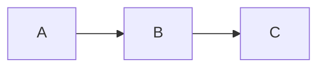

# Disclaimer
Hugo already has documentation on how to [add support for mermaid diagrams](https://gohugo.io/content-management/diagrams/#mermaid-diagrams) by using code block render hooks.

# Examples of Mermaid/Markdown Integration

TODO: Markmap diagrams integration should have zoom in/out controls, as well as auto-fit support.



```markmap
# Learning roadmap
## Fundamentals
### Networking
## Practice
### Labs
```
