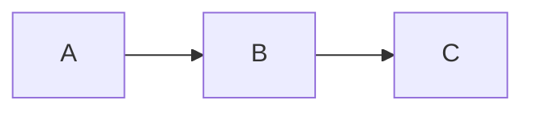

For mermaid support, Hugo already documents how to add it on top of an existing theme with code block render hooks: [add support for mermaid diagrams](https://gohugo.io/content-management/diagrams/#mermaid-diagrams).

For markmap support, a similar approach was taken in addition to using the [markmap-autoloader package](https://markmap.js.org/docs/packages--markmap-autoloader) and its API documentation.

The implementation is rather simple today. See the following files for reference:
- `layouts/_markup/render-codeblock-markmap.html`
- `layouts/_markup/render-codeblock-mermaid.html`

# Examples of Mermaid/Markdown Integration

TODO: Markmap diagrams integration should have zoom in/out controls, as well as auto-fit support.



```markmap
# Learning roadmap
## Fundamentals
### Networking
## Practice
### Labs
```
